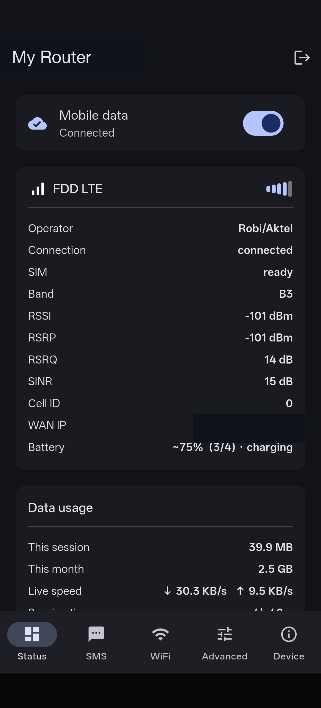
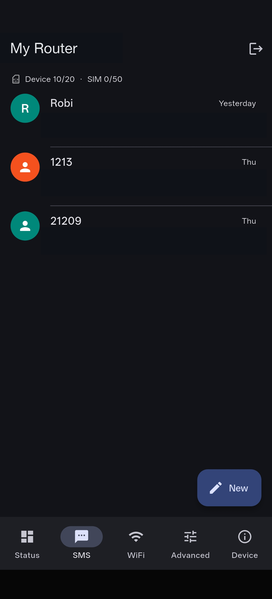
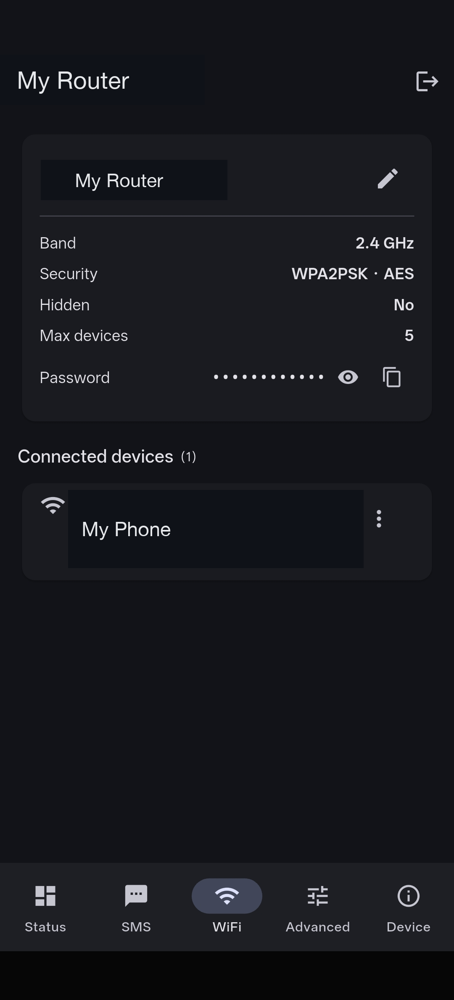
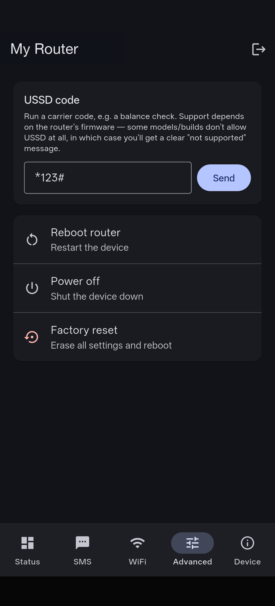

# Routspan

[](https://github.com/ajshovon/routspan/actions/workflows/ci.yml)
[](LICENSE)

**Routspan** is an open-source phone app (Flutter) to manage pocket / MiFi routers from your phone,
replacing the clunky browser admin panel. **First target: the OLAX M100** (ZTE-lineage firmware).
Designed so more routers can be added as "drivers" later.

> **Routspan is an independent, unofficial app** and is not affiliated with, endorsed by, or
> sponsored by OLAX, ZTE, or any of their affiliates. Product names and trademarks are the property
> of their respective owners and are used only for identification and interoperability.

> **Status:** working driver against a real OLAX M100. Implemented: **multiple saved routers**
> (pick from a list on launch, stored passwords, a default router that auto-connects), login,
> live status (signal/battery/network), **mobile-data on/off**, data usage + plan, threaded
> **SMS** (Android-Messages-style conversations: read/send/delete/mark-read), USSD, WiFi
> view/edit (with password reveal/copy), connected-devices list with rename, and reboot /
> power-off / factory-reset. The ZTE API is verified in
> [`docs/olax-m100-api.md`](docs/olax-m100-api.md).

## Preview

| Status | SMS | WiFi | Advanced |
| :---: | :---: | :---: | :---: |
|  |  |  |  |

> Router name, WiFi password, message content, and connected-device identifiers in these
> screenshots are placeholders/redacted — not the tester's real network.

## How it works

OLAX MiFi devices don't need HTML scraping — they expose an on-device HTTP/JSON RPC API (the same
API the stock web UI uses). The app:

1. Logs in with the ZTE `LD`/`RD`/`AD` challenge (see `lib/core/crypto.dart`).
2. Reads state via `cmd=` GET calls and performs actions via `goformId=` POST calls.
3. Routes everything through a vendor-neutral `RouterRepository` seam so a second router is a new
   driver file, not a rewrite.

```
UI (Flutter screens)
  → Riverpod providers
    → RouterRepository        (abstract seam + neutral domain models)
      → OlaxM100Client        (the only driver today)
        → ZteApiTransport     (Dio: dialect, cookies, LD/RD/AD auth)
```

## Prerequisites (none of these are installed yet on a fresh machine)

- **Flutter SDK** (stable, Dart ≥ 3.4) — https://docs.flutter.dev/get-started/install
- **Android SDK / Android Studio** (for building/running on Android)
- A **JDK 17** (bundled with Android Studio)

## First-time setup

```bash
# 1. Clone the repo:
git clone https://github.com/ajshovon/routspan.git
cd routspan

# 2. Install Flutter, then from the repo root generate the platform folders
#    (this fills in android/, ios/, etc. without touching lib/ or pubspec.yaml):
flutter create . --platforms=android,ios --project-name routspan --org me.shovon

# 3. Re-apply the Android cleartext-HTTP config (see "Android setup" below) if
#    `flutter create` overwrote it.

# 4. Fetch dependencies:
flutter pub get

# 5. Regenerate the app icon into the fresh platform folders (source assets
#    live in assets/icon/ — see pubspec.yaml's flutter_launcher_icons: block):
dart run flutter_launcher_icons

# 6. Run on a connected Android device joined to the router's WiFi:
flutter run
```

## Android setup (required — the router API is plain HTTP)

Android blocks cleartext HTTP by default. This repo ships
`android/app/src/main/res/xml/network_security_config.xml` permitting cleartext to private ranges.
After `flutter create`, ensure `android/app/src/main/AndroidManifest.xml` has, on `<application>`:

```xml
<application
    ...
    android:networkSecurityConfig="@xml/network_security_config"
    android:usesCleartextTraffic="false">
```

and that `<uses-permission android:name="android.permission.INTERNET"/>` and
`android.permission.ACCESS_NETWORK_STATE` are present.

> **Known gotcha:** when the router's SIM has no data, Android marks its WiFi "no internet" and may
> send traffic over mobile data, so calls to `192.168.x.x` can fail. See the plan's "Android
> gotchas" — the fix is to bind requests to the WiFi network. Test on a real device with mobile
> data ON.

### Building per-architecture APKs

```bash
tool/build_debug_apks.sh                    # all ABIs → dist/debug-apks/
tool/build_release_apks.sh                  # all ABIs → dist/release-apks/
tool/build_release_apks.sh arm64-v8a        # just one, e.g. to test on a specific device
```

Debug APKs are large (~60–85 MB each) — they bundle the JIT-capable Dart VM, a debug Flutter
engine, a Vulkan validation layer, and an un-tree-shaken icon font, none of which ship in release.
Use `build_release_apks.sh` for anything you actually want to hand someone to install (~15–20 MB
per architecture). Note: release builds currently sign with the **debug keystore** (see the TODO
in `android/app/build.gradle.kts`) — fine for sideloading/testing, not for a real store listing or
an "official" distributed build until a proper signing config is added.

`dist/` is gitignored — these are local build outputs, not committed release artifacts.

## Contributing

See [`CONTRIBUTING.md`](CONTRIBUTING.md). The near-term ask: capture your own OLAX M100 traffic and
help complete [`docs/olax-m100-api.md`](docs/olax-m100-api.md).

This project follows a [Code of Conduct](CODE_OF_CONDUCT.md). Found a security issue? See
[`SECURITY.md`](SECURITY.md) for how to report it privately.

## License & attribution

Routspan is free and open-source software licensed under the **MIT License** — see
[`LICENSE`](LICENSE).

- **Dependencies** are all under permissive licenses (MIT / BSD): `dio`, `dio_cookie_manager`,
  `cookie_jar`, `flutter_riverpod`, `crypto`, `flutter_secure_storage`, `shared_preferences`,
  `intl`, plus Flutter/Dart themselves. Their full license texts are viewable in-app under
  **Device → About → Open-source licenses** (Flutter's aggregated `LicenseRegistry`).
- **Trademarks.** OLAX and ZTE, and any other product names referenced, are trademarks of their
  respective owners. Routspan is an independent interoperability tool and names them only to
  describe the hardware it works with (nominative fair use). It ships no vendor firmware, logos,
  or other proprietary assets.
- **Privacy.** Routspan talks only to your router over your local network; it has no backend and
  collects no telemetry. Passwords are stored in the platform keychain/keystore. Traffic captures
  used during development (`curls.txt`, `*.har`, `screenshots/`) contain personal data and are
  git-ignored — never commit them.
